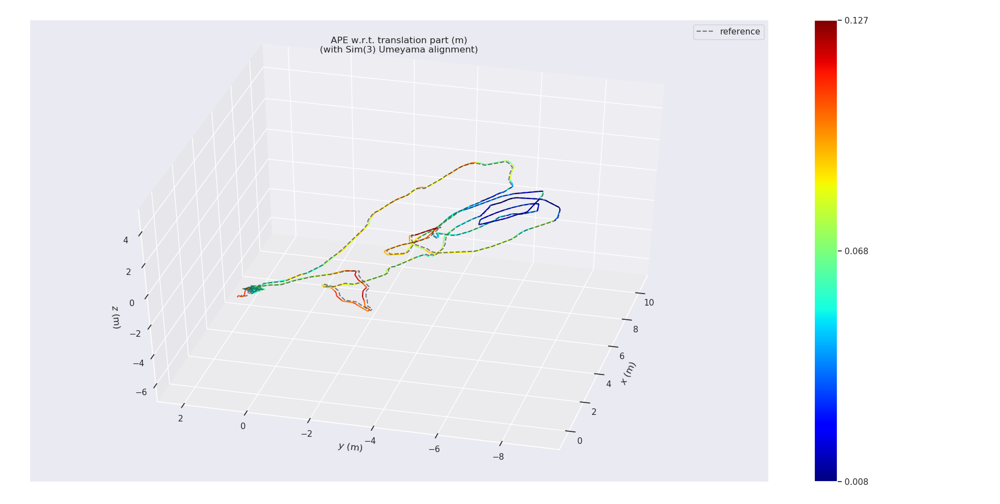
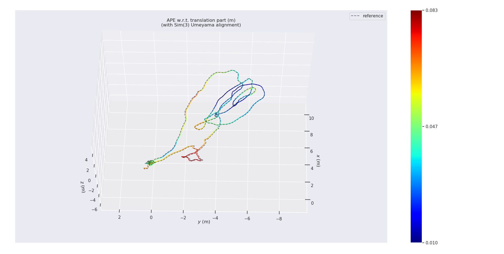

# vins_estimator_arm
visual inertial odometry running in embedded system, such as cortex-a53 or cortex-a7. modified from vins-mono

## 前言

本项目代码是一个视觉惯性里程计，修改自vins-mono，目的是想在cortex-a53或者cortex-a7这类嵌入式系统中运行视觉惯性里程计。在比较几个开源里程计后，发现vins-mono结构性最好且具有相当高的精度，最终选择从vins-mono修改  

## 主要内容

本项目里程计前端包含图像特征点提取，光流跟踪特征点。里程计后端包括imu预计分，ceres优化10帧sliding window，sliding window划出关键帧边缘化。前端和后端的大部分代码源自vins-mono，去掉vins-mono对ros的依赖，对于vins-mono中冗余的内容进行了简化。另外，由于cortex-a53或者cortex-a7的算力限制，本项目里程计不包含闭环检测和pose graph优化  

vins_estimator_a53和vins_estimator_a7两个文件夹单独使用  

## 与vins-mono的主要区别

重新定义image,imu,pointcloud消息，替代原ros消息  

去掉vins-mono中num_cam相关项，去掉一系列ros::publish项，仅保留位姿保存文件  

cameramodel仅保留camera基类，camerafactory，pinhole camera，equidistant camera，去掉标定和其他相机模型  

camera基类中增加getFocalLength函数获取焦距，去掉vins-mono代码中直接给定的焦距值和直接给定的浮点数460，以适配其他镜头  

去掉闭环和pose graph相关部分  

## 运行效率

在cortex-a53上运行帧率约为3帧/秒，前端提特征和光流跟踪一共需要80～90ms，后端ceres优化一次需要240～250ms  

在cortex-a7上运行帧率约为1帧/秒，前端提特征和光流跟踪一共需要240～250ms，后端ceres优化一次需要850～950ms  

## 轨迹对比

本节轨迹对比的refrence是pc上运行vins-mono得到的no loop path  

似乎a7运行的误差比a53小，疑似原因是a7并不是实时运行，处理的帧比a53多  

### cortex-a53


### cortex-a7


## 交叉编译器

对于cortex-a53处理器，使用gcc-arm-10.2-2020.11-x86_64-aarch64-none-linux-gnu.tar.xz  

对于cortex-a7，使用gcc-arm-10.2-2020.11-x86_64-arm-none-linux-gnueabihf.tar.xz  


## 第三方库

本项目运行需要eigen,opencv,boost,ceres，编译ceres还需要atlas,suitsparse。在cortex-a53或者cortex-a7上运行，需要相应环境的库。在CmakeLists.txt中直接链接编译好的第三方库  

目前本项目中没上传这些第三方库的头文件和编译好的so文件，如有需要再看怎么上传  

## 编译

```
mkdir build
cd build
cmake ..
make
```

## 运行

```
scp vins_estimator usrname@xxx.xxx.xxx.xxx:/home/usrname
vins_estimator ./config/euroc_config.yaml
```


